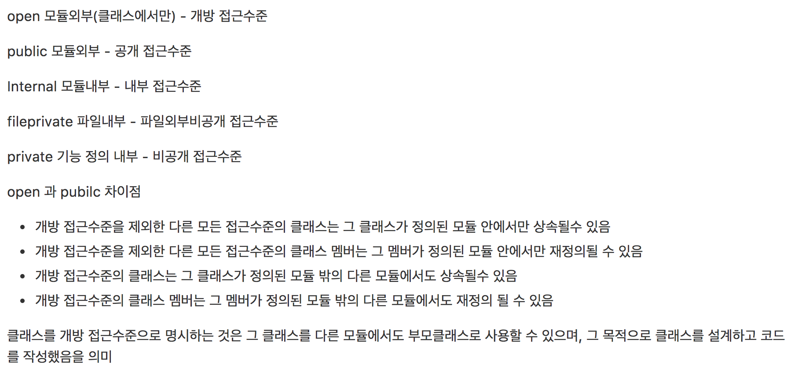

## git

``$ git checkout brunchName`` 브랜치 바꾸기
``$ git rebase brunchName`` 현재 브랜치 베이스가 되는 지점부터의 history를 다른 브랜치로 옮김
``$ git merge brunchName`` 합칠 브랜치 수정내용만 현재 내 브랜치로 옮김

``$ git reset --hard HEAD~1`` 커밋된거 취소 (``--hard`` 옵션을 쓰지 않으면 파일은 마지막 수정상태에 있음)

## git 과 svn의 차이점

* svn으로 작업할 때에는 개발자가 자신만의 버전관리를 가질수 없고 commit 내용에 실수가 있을시에 다른 개발자에게 영향을 미치게됨.
* 중앙저장소에서 개발자 개별로 브랜치를 따로 만들어주고 관리하기 힘듬
* git은 개발자가 commit history를 가질 수 있고 개발자와 서버의 저장소를 독립적으로 관리 가능

## swift3에서 변경된 사항들

#### NS Prefix 없어짐

> NS는 NextStep의 약자. 스티브 잡스가 깊게 관여한 macOS의 전신인 OS X의 전신인 MacOS전신... 의 OS의 이름이라고 함

#### 싱글톤 변화
싱글톤 팩토리가 이름이 축약되고 프로퍼티 형식이됨.
NSBundle.mainBundle() -> Bumdle.main

#### 열거형 변화
case이름이 전부 소문자로 바뀜

#### C함수들 변화

````
dispatch_async(dispatch_get_main_queue()) { ... }
````

이렇게 쓰이던게

````
DispatchQueue.main.async { ... }
````

이렇게 변했다.

#### Access Control

기존에는 public, internal, private가
public, open, internal, private, fileprivate로 바뀜



<https://github.com/pikachu987/TIL/tree/master/swift>


#### 반환값

`` _ = vc.navigationController?.popViewController(animated: true) ``

이렇게 `` _ = ``라는 반환값을 안써주면 경고를 낸다.

#### 탈출클로져


<https://github.com/pikachu987/TIL/tree/master/swift>


## enumerated

````
let foo = ["kim", "park", "lee"]
for (index, element) in foo.enumerated(){
      print("index: \(index), element: \(element)")
}
````


## map

map은 자신을 호출 할 때 매개변수로 전달된 함수를 실행하여 그 결과를 다시 반환해주는 함수.
배열, 딕셔너리, 세트, 옵셔널 등에서 사용할 수 있음.

````
let numberArray = [2, 4, 6, 8]
numberArray.map { (number) -> Int in
    return number*3
}
````

클로저 사용
````
numberArray.map {$0 * 4}
````

## filter

필터는 컨테이너 내부의 값을 걸러서 추출하는 역활

````
let numberArray = [2, 3, 4, 6, 8, 9]
let newNumbers = numberArray.filter({ $0 % 2 != 0})
````

## reduce

리듀스는 컨테이너 내부의 콘텐츠를 하나로 합쳐주는 기능

````
let numberArray = [2, 3, 4, 6, 8, 9]
let newNumbers = numberArray.reduce(0){
    return $0 + $1
}
let strArray = ["w", "o", "r", "l", "d"]
let newStr = strArray.reduce("hello "){
    return $0 + $1
}
````


## Animate

````
UIView.animate(
      withDuration: TimeInterval, 
      delay: TimeInterval, 
      options: UIViewAnimationOptions, 
      animations: () -> Void, 
      completion: ((Bool) -> Void)?
      )
````

withDuration: 해당 TimeInterval 동안 애니메이션이 실행
delay: TimeInterval 의 딜레이를 준 후에 애니메이션이 실행
options:
* UIViewAnimationOptions.autoreverse : 애니메이션이 실행한 후 다시 반대의 애니메이션을 실행하며 원점으로 되돌아 갔다가 옴(원점으로 갔다 왔을때 completion이 실행된다.)
* UIViewAnimationOptions.repeat : 애니메이션이 계속 반복함
* UIViewAnimationOptions.curveEaseIn
* UIViewAnimationOptions.curveEaseInOut
* UIViewAnimationOptions.curveEaseOut
* UIViewAnimationOptions.curveLinear


## autolayout

#### priority: 높은 priority 값부터 동작함

휴대폰의 화면 해상도가 기기마다 달라서 우선순위를 지정한다.

예를들어 스토리보드상에 두개의 Label에 width를 각각 주고 두개의 Label에 top, bottom, trailing, leading를 주게 되고 실행을 하면
기기에 따라

(1) look at each constraint and try to figure out which you don't expect; 
(2) find the code that added the unwanted constraint or constraints and fix it. 

라는 에러가 나오게 된다.

이런 경우에 어떤 Constraints를 먼저 실행할지 우선순위를 정하는데 1000이 제일 높은 값이며 높은 값부터 우선순위가 매겨진다.

1번 Label에 1000보다 낮은값(ex 750)을 주면 2번 Label에 지정한 width가 먼저 나오고 1번 Label은 화면크기에 맞춰서 된다.

#### multiplier: 상대적인 비율로 크기를 결정할 수 있다.

다양한 슈퍼 뷰의 크기에 대응하기 위한 레이아웃이므로 비율을 통해 레이아웃을 설정해야 하는 경우 사용을 한다.


## GCD

GCD 문법은 전에 정리를 해둔게 있는데 <https://github.com/pikachu987/GCDExample> 여기에 들어가면 볼수 있다.

Dispatch의 부모를 타고타고 올라가면 이런 구조이다.
````
public protocol NSObjectProtocol{

}
open class NSObject : NSObjectProtocol{

}
open class OS_object : NSObject {

}
open class DispatchObject : OS_object {

}
open class DispatchQueue : DispatchObject {

}
````

GCD는 NSThread를 직접 구현하지 않기 위한 비동기 매니져이며 C로 구성되어 있다. GCD는 비동기 업무에 대한 관리를 해주며, 내부의 쓰레드풀에서 일감을 큐에서 가져와서 처리한다.


