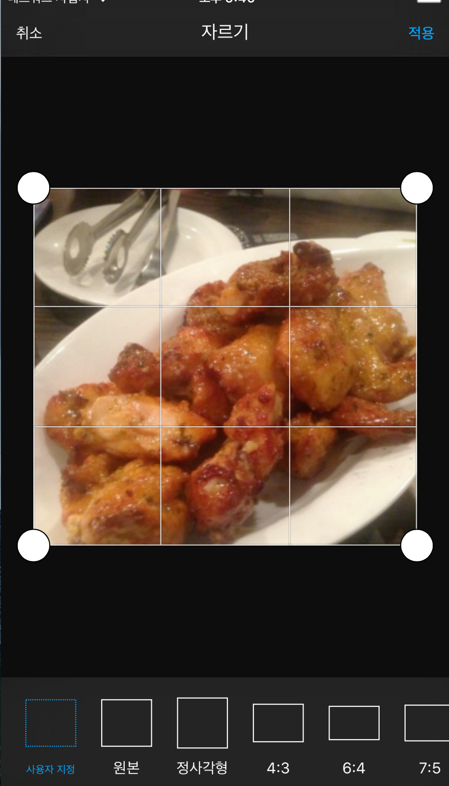

## Swift

### Adobe Image Editor 사용하기

해당 설명은 [pikachu987.github.io/tec/](https://pikachu987.github.io/tec/swift/2016/09/12/swiftAdobeImageEditro/) 여기서 확인 할수있다.

-- 주의할점
AdobeCreativeSDKImage.framework 파일이 100M가 넘기 때문에 git 에 올리지 못한다.

[구글드라이브](https://drive.google.com/drive/folders/0B9LPAVZlBrqSeXNRWmE4TC1sNWM?usp=sharing) 에서 
AdobeCreativeSDKImage.framework 를 다운받고 프로젝트 폴더에 넣고 framework폴더에 붙여야한다.

 

[동영상보기](https://www.youtube.com/embed/8VzEs-gEeEQ)
